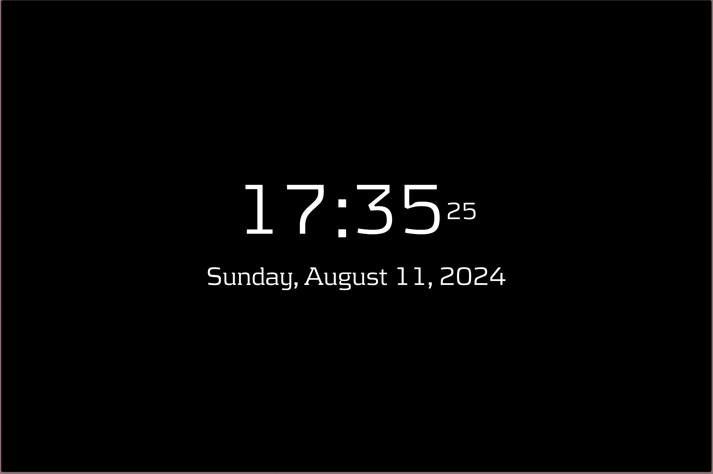

# Clock & Date with Vue.js and Moment.js

This project showcases a real-time digital clock and date display using Vue.js and Moment.js. The clock updates every second and shows the current time in hours, minutes, and seconds. 
The date is displayed below the clock in a stylized format.

## Features

- Real-time clock updating every second.
- Displays hours, minutes, and seconds.
- Shows the current date in a readable format.
- Responsive design for various screen sizes.
- Custom fonts for a unique look.
- Accessible for screen readers.

## Technologies Used

- [Vue.js](https://vuejs.org/) - JavaScript framework for building user interfaces.
- [Moment.js](https://momentjs.com/) - JavaScript library for parsing, validating, manipulating, and formatting dates.
- [Bootstrap](https://getbootstrap.com/) - CSS framework for responsive design.
- [Spectrum Colorpicker](https://bgrins.github.io/spectrum/) - Color picker library.

## Installation

1. Clone this repository:

    ```bash
    git clone https://github.com/masdzub/clock.git
    ```

2. Navigate to the project directory:

    ```bash
    cd clock
    ```

3. Open `index.html` in your preferred browser.

## Usage

The project includes a simple HTML file that integrates Vue.js and Moment.js to display a real-time clock and date. The clock is updated every second using Vue's reactivity system, and the current date is formatted using Moment.js.

## Customization

- **Fonts**: Custom fonts are used for the clock and date. If you want to change fonts, modify the `font-family` properties in the CSS.
- **Styling**: Adjust the styling of the clock and date by modifying the CSS rules in the `<style>` section of `index.html`.
- **Date Format**: Change the date format by modifying the `moment().format()` function in the Vue.js script.

## Code Overview

- **HTML**: Contains the structure of the clock and date display.
- **CSS**: Handles the styling and responsive design of the clock and date.
- **JavaScript**: Vue.js and Moment.js scripts for updating and displaying the time and date.

## Screenshoot



## Contributing

Feel free to open issues, submit pull requests, or contribute in any way. If you have suggestions or improvements, we welcome your feedback!

## License

This project is licensed under the MIT License - see the [LICENSE](LICENSE) file for details.

## Contact

For any questions or comments, please contact [hello@masdzub.com](mailto:hello@masdzub.com).